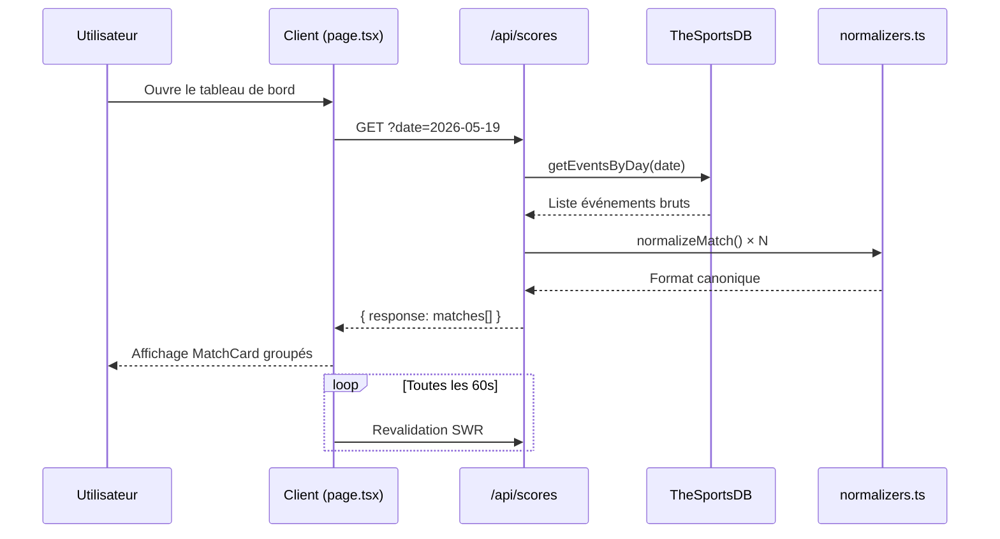
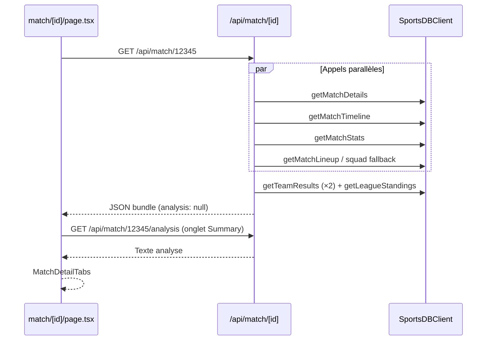
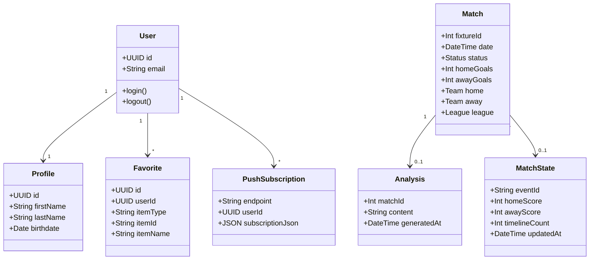
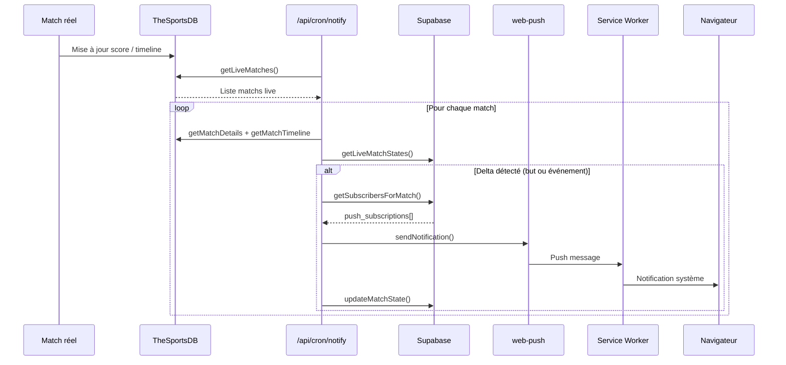
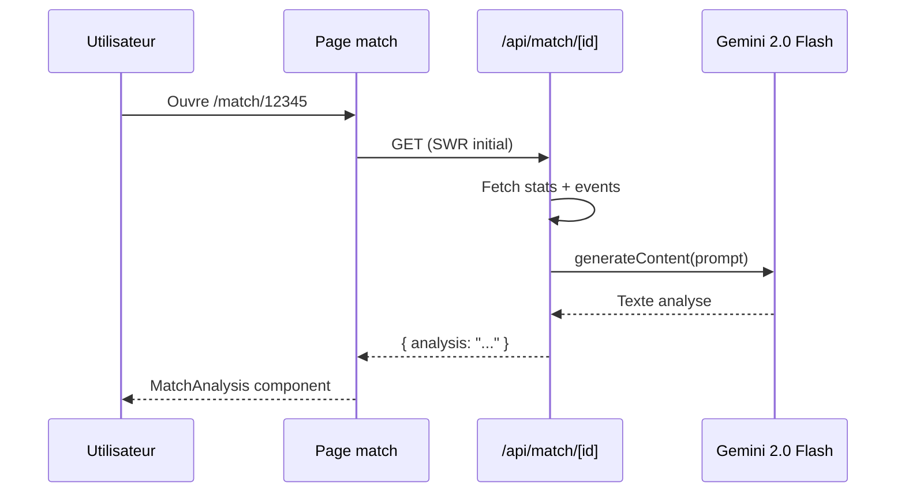
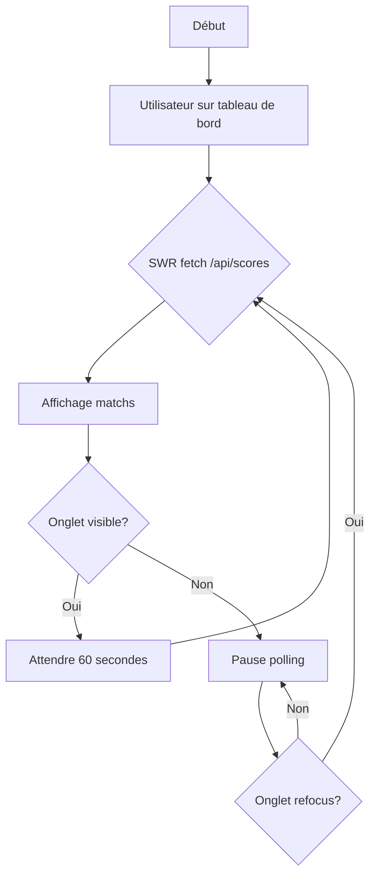
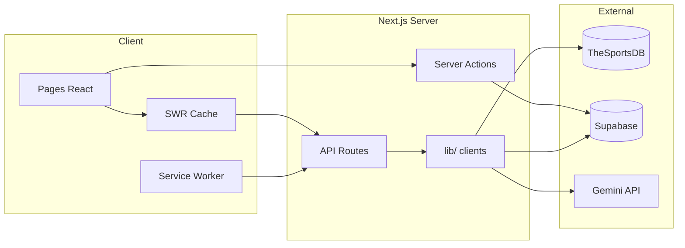

# Rapport Académique de Projet

## Ch'hal Daro — Plateforme Web de Scores Football en Temps Réel

---

| **Élément** | **Détail** |
|-------------|------------|
| **Intitulé du projet** | Ch'hal Daro — Football Live Score |
| **Type de travail** | Projet de fin de module / application web full-stack |
| **Établissement** | EMSI (École Marocaine des Sciences de l'Ingénieur) — 4ᵉ année |
| **Stack principale** | Next.js 16, React 19, TypeScript, Supabase, Tailwind CSS v4 |
| **Licence** | MIT |
| **Version** | 0.1.0 |
| **Branche de release** | `v0.1` |
| **Dépôt** | [github.com/aminecharro01/Ch-halDaro](https://github.com/aminecharro01/Ch-halDaro) |

---

## Résumé (Abstract)

**Ch'hal Daro** (expression marocaine signifiant approximativement « combien il y a » / « quel est le score ») est une application web progressive (PWA) dédiée au suivi des rencontres de football. Elle agrège des données sportives en temps quasi réel, propose une interface utilisateur moderne en mode sombre, et enrichit l'expérience par des fonctionnalités avancées : favoris personnalisés, analyses automatiques du match, prédictions probabilistes, et notifications push Web.

Le projet illustre la mise en œuvre d'une architecture **JAMstack** moderne : rendu hybride (Server Components et Client Components), routes API serverless, persistance PostgreSQL via Supabase, et intégration de services tiers (TheSportsDB, moteur de génération de texte, Resend pour les e-mails). Ce document présente le contexte, les objectifs, la conception technique, la modélisation UML, ainsi que les limites et perspectives d'évolution du système — état du code aligné sur la **version 0.1.0** (branche `v0.1`).

**Mots-clés :** football, live scoring, Next.js, PWA, Web Push, Supabase, SWR, TheSportsDB.

---

## Table des matières

1. [Introduction](#1-introduction)
2. [Contexte et problématique](#2-contexte-et-problématique)
3. [Objectifs du projet](#3-objectifs-du-projet)
4. [Analyse des besoins](#4-analyse-des-besoins)
5. [État de l'art et positionnement](#5-état-de-lart-et-positionnement)
6. [Architecture du système](#6-architecture-du-système)
7. [Choix technologiques](#7-choix-technologiques)
8. [Modèle de données](#8-modèle-de-données)
9. [Description fonctionnelle détaillée](#9-description-fonctionnelle-détaillée)
10. [Couche API et flux de données](#10-couche-api-et-flux-de-données)
11. [Interface utilisateur et expérience (UX/UI)](#11-interface-utilisateur-et-expérience-uxui)
12. [Analyses et prédictions](#12-analyses-et-prédictions)
13. [Notifications push](#13-notifications-push)
14. [Sécurité](#14-sécurité)
15. [Structure du code source](#15-structure-du-code-source)
16. [Configuration et déploiement](#16-configuration-et-déploiement)
17. [Diagrammes UML](#17-diagrammes-uml)
18. [Tests et validation](#18-tests-et-validation)
19. [Limites, contraintes et perspectives](#19-limites-contraintes-et-perspectives)
20. [Conclusion](#20-conclusion)
21. [Références et bibliographie](#21-références-et-bibliographie)
22. [Annexes](#22-annexes)

---

## 1. Introduction

Le football demeure le sport le plus suivi au monde. Les supporters recherchent des plateformes capables de fournir des scores actualisés rapidement, des statistiques détaillées, et une personnalisation selon leurs équipes et compétitions favorites. Les applications grand public (Flashscore, Sofascore, OneFootball, etc.) ont établi des standards élevés en termes de réactivité et de richesse fonctionnelle.

**Ch'hal Daro** s'inscrit dans ce contexte en proposant une solution web développée dans le cadre d'un projet académique EMSI. L'ambition n'est pas de rivaliser commercialement avec les leaders du marché, mais de démontrer la maîtrise d'un écosystème technologique contemporain : framework React/Next.js, authentification cloud, APIs REST externes, analyses textuelles automatiques, notifications push et e-mail.

Le nom du projet ancre volontairement l'identité dans la culture footballistique marocaine, avec notamment l'intégration de la **Botola Pro** parmi les ligues filtrables sur le tableau de bord.

---

## 2. Contexte et problématique

### 2.1 Contexte général

L'accès à l'information sportive se fait majoritairement via mobile. Les utilisateurs attendent :

- une **latence minimale** sur les scores en direct ;
- une **interface lisible** en conditions variées (luminosité, taille d'écran) ;
- la possibilité d'être **alertés** sans garder l'application ouverte ;
- un **fil personnalisé** basé sur leurs centres d'intérêt.

### 2.2 Problématique

Comment concevoir une application web full-stack qui :

1. agrège des données sportives hétérogènes provenant d'APIs tierces ;
2. normalise ces données pour un affichage cohérent côté client ;
3. associe comptes utilisateurs, favoris et abonnements push de manière persistante ;
4. enrichit les données brutes par des **analyses narratives** automatiques ;
5. reste déployable sur une infrastructure **serverless** à coût maîtrisé (plan gratuit Vercel) ?

Cette problématique oriente l'ensemble des choix architecturaux du projet.

---

## 3. Objectifs du projet

### 3.1 Objectif principal

Développer une plateforme web performante de suivi footballistique, accessible sans installation native (PWA), avec authentification et personnalisation.

### 3.2 Objectifs spécifiques

| # | Objectif | Indicateur de réussite |
|---|----------|------------------------|
| O1 | Affichage des scores du jour avec rafraîchissement automatique | Polling SWR toutes les 60 s sur la page d'accueil |
| O2 | Page détail match riche (événements, stats, compositions) | Onglets Info, Events, Stats, Line-ups, H2H, Table, TV |
| O3 | Authentification sécurisée | Inscription / connexion via Supabase Auth |
| O4 | Système de favoris (équipes, ligues, matchs) | CRUD complet via `/api/favorites` |
| O5 | Analyses et résumés match (post-match / live) | Moteur génératif + repli rule-based (`content-fallback.ts`) |
| O6 | Notifications push et e-mail sur événements live | Service Worker, cron `/api/cron/notify`, Resend |
| O7 | Interface premium en mode sombre | Design glassmorphism, animations CSS |
| O8 | Section dédiée Coupe du Monde 2026 | Page SSR avec classements par groupes |

### 3.3 Objectifs pédagogiques

- Maîtriser le **App Router** de Next.js et la séparation Server/Client Components.
- Implémenter un **adaptateur de données** (pattern normalizer) pour découpler les APIs externes du frontend.
- Comprendre les mécanismes **Web Push** et les contraintes du déploiement serverless.
- Intégrer un **service de génération de texte** dans un flux applicatif métier avec gestion des quotas.

---

## 4. Analyse des besoins

### 4.1 Acteurs

| Acteur | Description |
|--------|-------------|
| **Visiteur** | Consulte scores, ligues, matchs sans compte |
| **Utilisateur authentifié** | Gère favoris, profil, abonnements push |
| **Système cron (Vercel)** | Déclenche la vérification des matchs en direct |
| **APIs externes** | TheSportsDB v1/v2, Google Generative AI (optionnel), Resend |

### 4.2 Besoins fonctionnels

| ID | Besoin | Priorité |
|----|--------|----------|
| BF01 | Consulter les matchs d'une date (hier / aujourd'hui / demain) | Haute |
| BF02 | Filtrer par ligue (LDC, PL, La Liga, Serie A, Bundesliga, Botola) | Haute |
| BF03 | Identifier visuellement les matchs en direct | Haute |
| BF04 | Accéder au détail d'un match | Haute |
| BF05 | Voir chronologie, statistiques, compositions | Haute |
| BF06 | S'inscrire / se connecter / se déconnecter | Moyenne |
| BF07 | Ajouter / retirer des favoris | Moyenne |
| BF08 | Recevoir des notifications (buts, cartons) | Moyenne |
| BF09 | Obtenir une analyse / résumé du match | Moyenne |
| BF13 | Rechercher équipes, joueurs, compétitions | Moyenne |
| BF14 | Filtrer ligues par région géographique | Moyenne |
| BF10 | Consulter prédictions pré-match (probabilités) | Basse |
| BF11 | Page équipe, ligue, région géographique | Moyenne |
| BF12 | Section Coupe du Monde 2026 | Basse |

### 4.3 Besoins non fonctionnels

| ID | Besoin | Solution retenue |
|----|--------|------------------|
| BNF01 | Performance | Cache `revalidate: 60` sur fetch serveur ; SWR côté client |
| BNF02 | Responsive design | Tailwind CSS, grilles flexibles |
| BNF03 | Sécurité des clés API | Variables d'environnement serveur uniquement |
| BNF04 | Disponibilité | Déploiement Vercel, CDN edge |
| BNF05 | Maintenabilité | Structure `src/`, séparation lib / components / app |
| BNF06 | Accessibilité partielle | Contraste élevé mode sombre, labels sur boutons |

---

## 5. État de l'art et positionnement

### 5.1 Solutions existantes

Les applications de référence (Sofascore, Flashscore, FotMob) proposent :

- couverture mondiale exhaustive ;
- applications natives iOS/Android ;
- commentaires live, xG, notes joueurs ;
- monétisation (publicité, abonnements).

### 5.2 Positionnement de Ch'hal Daro

Ch'hal Daro se positionne comme un **prototype académique** mettant l'accent sur :

- les **analyses automatiques** (résumés, duels clés, prédictions) plutôt que sur l'exhaustivité des données ;
- une **stack web moderne** (Next.js 16, React 19) ;
- les **Web Push Notifications** sans application native ;
- une identité visuelle **gaming / premium** en dark mode.

Les limites volontaires (quota API, cron journalier sur plan Hobby) sont documentées en section 19.

---

## 6. Architecture du système

### 6.1 Vue d'ensemble

L'application suit une architecture **three-tier** adaptée au serverless :

```
┌─────────────────────────────────────────────────────────────────┐
│                    COUCHE PRÉSENTATION                          │
│  React 19 + Next.js App Router (pages, composants client)       │
│  SWR (polling), Tailwind CSS v4, Service Worker (PWA)           │
└────────────────────────────┬────────────────────────────────────┘
                             │ HTTP (fetch)
┌────────────────────────────▼────────────────────────────────────┐
│                    COUCHE APPLICATION                             │
│  Next.js Route Handlers (/src/app/api/*)                        │
│  Server Actions (login, signup, logout)                           │
│  proxy.ts (middleware Supabase — rafraîchissement session)        │
└────────────┬───────────────────────────────┬────────────────────┘
             │                               │
┌────────────▼────────────┐    ┌─────────────▼────────────────────┐
│   COUCHE DONNÉES        │    │   SERVICES EXTERNES              │
│   Supabase (PostgreSQL) │    │   TheSportsDB v1/v2              │
│   - auth.users          │    │   Generative AI (GEMINI_API_KEY)   │
│   - profiles            │    │   Resend (e-mail)                │
│   - favorites           │    │   Web Push (VAPID)               │
│   - push_subscriptions  │    │                                  │
│   - match_states        │    │                                  │
└─────────────────────────┘    └──────────────────────────────────┘
```

### 6.2 Pattern architectural : Backend-for-Frontend (BFF)

Les routes API Next.js agissent comme une **couche BFF** :

- elles masquent les clés API aux clients ;
- elles **normalisent** les réponses TheSportsDB vers un format unifié (compatible avec l'ancien format API-Football) ;
- elles agrègent plusieurs appels (détail match + timeline + stats + lineups en parallèle).

### 6.3 Rendu hybride

| Type de page | Stratégie | Exemple |
|--------------|-----------|---------|
| SSR (Server Component) | Données fetchées au build/requête | `world-cup-2026/page.tsx`, `layout.tsx` |
| CSR (Client Component) | SWR + état local | `page.tsx` (accueil), `match/[id]/page.tsx` |
| Server Actions | Mutations auth | `login/actions.ts` |

### 6.4 Refactorisation structurelle (`src/`)

Le projet a migré d'une racine `app/` vers une structure **`src/`** conforme aux conventions Next.js modernes :

- `src/app/` — routes et API ;
- `src/components/` — UI réutilisable (`match/`, `team/`, `ui/`) ;
- `src/lib/` — logique métier, clients API, Supabase.

L'alias TypeScript `@/*` pointe vers `./src/*`.

---

## 7. Choix technologiques

### 7.1 Tableau récapitulatif

| Technologie | Version | Rôle |
|-------------|---------|------|
| **Next.js** | 16.2.2 | Framework full-stack, App Router, API Routes |
| **React** | 19.2.4 | Bibliothèque UI |
| **TypeScript** | 5.x | Typage statique |
| **Tailwind CSS** | 4.x | Styling utilitaire, thème sombre |
| **SWR** | 2.4.x | Cache et revalidation côté client |
| **Supabase** | 2.x | Auth + PostgreSQL |
| **@google/generative-ai** | 0.24.x | Client Gemini |
| **web-push** | 3.6.x | Envoi notifications serveur |
| **lucide-react** | 1.14.x | Iconographie |
| **TheSportsDB** | v1 + v2 | Source principale données sportives |
| **Resend** | — | E-mails transactionnels (alertes) |
| **Vercel** | — | Hébergement, cron jobs, edge |

### 7.2 Justifications détaillées

#### Next.js 16 & React 19

Le **App Router** permet de combiner Server Components (réduction du JavaScript envoyé) et Client Components (interactivité). React 19 apporte des améliorations de performance et l'API `use()` pour la résolution asynchrone des `params` dans les pages dynamiques.

#### SWR (Stale-While-Revalidate)

Indispensable pour le live scoring : stratégie **stale-while-revalidate** avec `refreshInterval: 60000` (60 secondes) sur le tableau de bord. SWR suspend le polling lorsque l'onglet est inactif (`revalidateOnFocus`), optimisant les quotas API.

#### Supabase

Solution **BaaS** (Backend-as-a-Service) offrant :

- authentification email/mot de passe ;
- base PostgreSQL managée ;
- client JavaScript avec gestion des cookies SSR (`@supabase/ssr`).

#### TheSportsDB (source principale)

Choix motivé par :

- API gratuite avec clé (`THESPORTSDB_KEY`) ;
- endpoints v2 pour livescore, timeline, stats ;
- couverture large des compétitions.

Un module `SportsDBClient` encapsule les appels v1/v2.

#### Couche de normalisation

Le fichier `src/lib/api/normalizers.ts` transforme les structures TheSportsDB en format **canonique** :

```typescript
// Format unifié exposé au frontend
{
  fixture: { id, date, venue, status },
  league: { id, name, logo },
  teams: { home, away },
  goals: { home, away }
}
```

Ce pattern **Anti-Corruption Layer** (DDD) isole le domaine applicatif des changements d'API fournisseur.

#### Google Gemini 2.0 Flash

Modèle choisi pour :

- latence faible ;
- coût inférieur aux modèles « Pro » ;
- génération de texte en français (prédictions) et anglais (analyses).

---

## 8. Modèle de données

### 8.1 Schéma logique Supabase

```
┌──────────────────┐       ┌──────────────────┐
│   auth.users     │       │    profiles      │
│──────────────────│       │──────────────────│
│ id (PK, UUID)    │──1:1─▶│ id (PK, FK)      │
│ email            │       │ first_name       │
│ ...              │       │ last_name        │
└────────┬─────────┘       │ birthdate        │
         │                 └──────────────────┘
         │
         │ 1:N
         ▼
┌──────────────────┐       ┌──────────────────────┐
│    favorites     │       │ push_subscriptions   │
│──────────────────│       │──────────────────────│
│ id (PK)          │       │ endpoint (PK)        │
│ user_id (FK)     │       │ user_id (FK, nullable)│
│ item_id          │       │ subscription_json    │
│ item_type        │       └──────────────────────┘
│ item_name?       │
│ item_logo?       │       ┌──────────────────────┐
└──────────────────┘       │   match_states       │
                           │──────────────────────│
                           │ event_id (PK)        │
                           │ home_score           │
                           │ away_score           │
                           │ minute               │
                           │ status               │
                           │ timeline_count       │
                           │ updated_at           │
                           └──────────────────────┘
```

### 8.2 Types de favoris (`item_type`)

| Valeur | Description |
|--------|-------------|
| `team` | Équipe favorite |
| `league` | Compétition favorite |
| `match` | Match spécifique suivi |

Contrainte d'unicité : `(user_id, item_id, item_type)`.

### 8.3 Entités métier (API externe — non persistées)

- **Match** : identifiant événement, statut, score, minute, ligue.
- **Événement timeline** : but, carton, remplacement, VAR.
- **Statistique** : possession, tirs, corners, etc.
- **Composition** : titulaires et remplaçants sur terrain visuel.

---

## 9. Description fonctionnelle détaillée

### 9.1 Tableau de bord (`/`)

**Comportement :**

- Sélecteur de date : hier / aujourd'hui / demain.
- Filtres par ligue : All, LDC, Premier League, La Liga, Serie A, Bundesliga, Ligue 1, Botola Pro.
- Regroupement des matchs par compétition ; recherche globale (`SearchBar` → `/api/search`).
- Section « Live » avec badge unifié (`MatchStatusBadge`) : heure de coup d'envoi, minute en direct, « Full time » à la fin.
- Saison par défaut **2025-2026** (`src/lib/season.ts`).
- Rafraîchissement automatique via `useSWR('/api/scores?date=...', { refreshInterval: 60000 })`.

**Composants :** `MatchCard`, `MatchStatusBadge`, `Sidebar`, `SearchBar`.

### 9.2 Page match (`/match/[id]`)

**Données chargées** (route `/api/match/[id]`) :

| Donnée | Source |
|--------|--------|
| Fixture | `sportsDB.getMatchDetails` |
| Événements | `sportsDB.getMatchTimeline` |
| Statistiques | `sportsDB.getMatchStats` |
| Compositions | `getMatchLineup` + repli effectif (`squadsToLineups`) |
| TV / Média | `getMatchTV`, `getMatchHighlights` |
| Head-to-head | `extractHeadToHead` sur résultats passés |
| Classement | `getLeagueStandings` + `mapStandings` |
| Analyse | **Lazy** : `/api/match/[id]/analysis` (non inclus dans le bundle GET) |

**Onglets (`MatchDetailTabs`) :**

| Onglet | Contenu |
|--------|---------|
| Info | Médias, TV, `KeyBattle`, `PredictionPanel` |
| Summary | Analyse tactique, résumé (`/summary`), `MatchAnalysis` si match terminé |
| Events | `EventTimeline` |
| Stats | `StatBar` |
| Line-ups | `SquadLineupList` (photos joueurs, numéros) |
| H2H | Historique confrontations |
| Table | Classement ligue |
| TV | Diffuseurs |

**Garde-fou quota API :** les routes `/summary`, `/key-battle` et `/analyze` exigent l'en-tête `X-Match-Visited: 1` (cookie local via `match-visit-tracker.ts`). Repli statistique via `content-fallback.ts` si quota dépassé.

### 9.3 Pages entité

| Route | Description |
|-------|-------------|
| `/league/[id]` | Calendrier, résultats, classement (groupes si LDC) |
| `/team/[id]` | Effectif, forme récente (`FormGuide`), matchs |
| `/region/[id]` | Ligues par région (Europe, Afrique, Amérique du Sud, Asie) |
| `/player/[id]` | Fiche joueur |
| `/tv` | Programme TV football |
| `/world-cup-2026` | Groupes et matchs CM 2026 (SSR) |
| `/profile` | Profil utilisateur connecté |
| `/login` | Connexion / inscription |
| `/alerts` | Gestion notifications push et préférences |

### 9.4 Authentification

Flux implémenté via **Server Actions** (`src/app/login/actions.ts`) :

1. **Login** : `signInWithPassword` → redirection `/`.
2. **Signup** : `signUp` + insertion table `profiles` (prénom, nom, date de naissance).
3. **Logout** : `signOut` + `revalidatePath`.
4. **Callback OAuth** : `/auth/callback` pour confirmation email.

Le fichier `proxy.ts` (équivalent middleware) rafraîchit la session Supabase à chaque requête.

### 9.5 Favoris

Composant `FavoriteButton` :

- `POST /api/favorites` — ajout (upsert).
- `DELETE /api/favorites` — suppression.
- `GET /api/favorites` — liste (utilisateur connecté uniquement).

Gestion gracieuse des colonnes optionnelles (`item_name`, `item_logo`) avec retry si schéma incomplet.

---

## 10. Couche API et flux de données

### 10.1 Inventaire des routes API

| Route | Méthode | Description |
|-------|---------|-------------|
| `/api/scores` | GET | Matchs du jour (param `date`) |
| `/api/match/[id]` | GET | Bundle complet match |
| `/api/match/[id]/summary` | GET | Résumé textuel (visite match requise) |
| `/api/match/[id]/key-battle` | GET | Duel clé |
| `/api/match/[id]/analysis` | GET | Analyse tactique lazy |
| `/api/match/team-info` | GET | Infos équipe |
| `/api/match/team-fixtures` | GET | Calendrier équipe |
| `/api/match/team-results` | GET | Résultats récents |
| `/api/match/team-squad` | GET | Effectif |
| `/api/player/[id]` | GET | Détail joueur |
| `/api/league/[id]` | GET | Données ligue (saisons) |
| `/api/region/[id]` | GET | Ligues par région |
| `/api/search` | GET | Recherche équipes / joueurs / ligues |
| `/api/predictions/[id]` | GET | Probabilités 1X2 + conseil |
| `/api/analyze` | POST | Analyse post-match |
| `/api/favorites` | GET/POST/DELETE | CRUD favoris |
| `/api/push/subscribe` | POST/DELETE | Abonnement push |
| `/api/subscribe` | POST | Alias push (rétrocompat.) |
| `/api/cron/notify` | GET | Cron — deltas + push + e-mail |
| `/api/test-notification` | POST | Test alertes (push / e-mail) |
| `/api/tv` | GET | Diffusions TV |

### 10.2 Flux : affichage des scores



### 10.3 Flux : détail match



---

## 11. Interface utilisateur et expérience (UX/UI)

### 11.1 Direction artistique

| Pilier | Implémentation |
|--------|----------------|
| **Mode sombre** | `className="dark"` sur `<html>`, fond `slate-950` |
| **Glassmorphism** | `backdrop-blur-xl`, `bg-black/30`, bordures `white/10` |
| **Typographie** | Police Google Fonts « Sofia Sans » |
| **Couleur accent** | Dégradé vert (`green-400` → `emerald-300`) — identité football |
| **Micro-animations** | `animate-fade-up`, `animate-pulse` sur badge Live |
| **PWA** | `manifest.json`, icône 192×192, `display: standalone` |

### 11.2 Composants clés

| Composant | Rôle |
|-----------|------|
| `MatchCard` | Carte résumé match dans le flux |
| `MatchStatusBadge` | Statut : heure, live (minute), full time |
| `StatBar` | Barres comparatives statistiques |
| `EventTimeline` | Chronologie verticale des événements |
| `SquadLineupList` | Compositions avec photos |
| `PredictionPanel` | Barres de probabilité 1X2 |
| `MatchAnalysis` | Analyse post-match (lazy) |
| `KeyBattle` | Duel tactique |
| `PendingFavoriteResume` | Reprise favori après login |
| `FormGuide` | Série de résultats récents (V/N/D) |
| `Sidebar` | Navigation ligues / liens rapides |
| `SkeletonCard` | État de chargement |

### 11.3 Responsive design

- Layout flex : colonne sur mobile, ligne sur `lg:` breakpoint.
- Navigation header : liens masqués sur petit écran (`hidden sm:block`).
- Scoreboard match : empilement vertical des équipes sur mobile.

---

## 12. Analyses et prédictions

### 12.1 Moteur d'analyse (`analysis-engine.ts`, routes dédiées)

**Modèle serveur :** `gemini-2.0-flash` (variable `GEMINI_API_KEY`). **Repli :** `content-fallback.ts` (résumés et analyses statistiques sans appel externe).

**Entrées du prompt :**

- noms des équipes, score, statut, ligue ;
- liste des événements (minute, joueur, type) ;
- statistiques JSON.

**Comportement adaptatif :**

| Statut match | Type de texte généré |
|--------------|---------------------|
| Terminé (`FT`) | Analyse post-match |
| En cours | Mise à jour du momentum |
| Pas commencé | Aperçu pré-match |

**Gestion d'erreurs :** message utilisateur si clé API absente ou quota dépassé (HTTP 429).

### 12.2 Prédictions (`/api/predictions/[id]`)

Prompt en **français** demandant :

- probabilités Home / Draw / Away totalisant 100 % ;
- conseil court (max 20 mots) ;
- réponse strictement en JSON.

Affichage via `PredictionPanel` avec barres de progression colorées.

### 12.3 Considérations éthiques

Les prédictions sont **indicatives** et ne constituent pas des conseils de paris. Un usage responsable devrait inclure un disclaimer visible (perspective d'amélioration).

---

## 13. Notifications push

### 13.1 Architecture

```
Utilisateur → /alerts → Service Worker (sw.js)
                      → PushManager.subscribe()
                      → POST /api/push/subscribe
                      → Supabase push_subscriptions

Vercel Cron → GET /api/cron/notify
            → sportsDB.getLiveMatches()
            → Comparaison avec match_states (delta)
            → getSubscribersForMatch() via favorites
            → sendPush() via web-push (VAPID)
            → sendEmail() via Resend (si RESEND_API_KEY + préférence utilisateur)
            → Service Worker affiche notification
```

### 13.2 Détection des deltas

Le cron compare pour chaque match live :

- **But** : `home_score` ou `away_score` modifié ;
- **Nouvel événement** : `timeline_count` augmenté.

Notifications typées :

| Événement | Titre | Corps |
|-----------|-------|-------|
| But | ⚽ GOAL !!! | Joueur + score |
| Carton rouge | 🟥 RED CARD ! | Joueur expulsé |
| Autre | ⚽ Live Score Update | Score actuel |

### 13.3 Service Worker (`public/sw.js`)

- Écouteur `push` : affichage notification avec icône, vibration, tag.
- Écouteur `notificationclick` : ouverture ou focus de l'URL `/match/[id]`.

### 13.4 Génération des clés VAPID

Script utilitaire : `npm run vapid` → `scripts/generateVapid.js`

Variables requises :

```env
NEXT_PUBLIC_VAPID_PUBLIC_KEY=...
VAPID_PRIVATE_KEY=...
VAPID_EMAIL=mailto:contact@example.com
```

### 13.5 Contrainte plan Vercel Hobby

Le fichier `vercel.json` configure un cron **quotidien** (`0 0 * * *`). Pour des notifications quasi temps réel, un plan Pro ou un service externe (UptimeRobot) doit appeler `/api/cron/notify` plus fréquemment.

> **Note technique :** vérifier que le chemin cron dans `vercel.json` correspond à la route réelle (`/api/cron/notify` et non `/api/notify`).

---

## 14. Sécurité

### 14.1 Mesures implémentées

| Mesure | Détail |
|--------|--------|
| Isolation des secrets | Clés API, GEMINI, Resend, VAPID côté serveur uniquement |
| Auth sur favoris | Vérification `getUser()` — HTTP 401 si anonyme |
| Cron protégé | Header `Authorization: Bearer ${CRON_SECRET}` si défini |
| Cookies Supabase | Gestion SSR sécurisée via `@supabase/ssr` |
| HTTPS | Imposé par Vercel en production |
| Nettoyage abonnements | Suppression endpoints expirés (HTTP 404/410) |

### 14.2 Points d'attention

- Les routes scores/match sont **publiques** (pas d'auth) — acceptable pour consultation.
- `push_subscriptions.user_id` peut être `null` (abonnement anonyme).
- Rate limiting TheSportsDB : repli `content-fallback` et messages utilisateur si HTTP 429 sur le moteur génératif.

---

## 15. Structure du code source

```
chhalDaro/
├── Doc/                                # Documentation projet (rapports, audit, sprints)
├── public/
│   ├── sw.js                           # Service Worker push
│   └── manifest.json                   # PWA
├── src/
│   ├── app/                            # App Router (pages + API)
│   │   ├── page.tsx, layout.tsx
│   │   ├── match/, league/, team/, region/, player/, tv/
│   │   ├── world-cup-2026/, login/, profile/, alerts/
│   │   └── api/                        # BFF (scores, match, cron, push, search…)
│   ├── components/
│   │   ├── match/                      # MatchCard, MatchDetailTabs, SquadLineupList…
│   │   ├── team/                       # FormGuide
│   │   └── ui/                         # Sidebar, SearchBar, FavoriteButton
│   └── lib/
│       ├── api/                        # sportsdb.ts, normalizers.ts, status-map.ts
│       ├── supabase/                   # client, server, queries
│       ├── push/webpush.ts
│       ├── email/send.ts               # Resend
│       ├── analysis-engine.ts
│       ├── content-fallback.ts
│       ├── match-visit-tracker.ts
│       ├── match-status.ts, season.ts, regions.ts
│       └── world-cup-2026-schedule.ts
├── scripts/generateVapid.js
├── proxy.ts                            # Session Supabase
├── vercel.json                         # Cron /api/cron/notify
├── README.md                           # Point d'entrée → Doc/
└── package.json                        # version 0.1.0
```

---

## 16. Configuration et déploiement

### 16.1 Variables d'environnement

| Variable | Obligatoire | Description |
|----------|-------------|-------------|
| `THESPORTSDB_KEY` | Oui | Clé API TheSportsDB (v1/v2) |
| `GEMINI_API_KEY` | Non* | Moteur génératif (*analyses en repli sans) |
| `NEXT_PUBLIC_SUPABASE_URL` | Oui** | URL projet Supabase |
| `NEXT_PUBLIC_SUPABASE_ANON_KEY` | Oui** | Clé anonyme Supabase |
| `NEXT_PUBLIC_VAPID_PUBLIC_KEY` | Push | Clé publique Web Push |
| `VAPID_PRIVATE_KEY` | Push | Clé privée Web Push |
| `VAPID_EMAIL` | Push | Contact VAPID (`mailto:…`) |
| `RESEND_API_KEY` | E-mail | Clé Resend |
| `EMAIL_FROM` | E-mail | Expéditeur (`Ch'hal Daro <…>`) |
| `CRON_SECRET` | Recommandé | `Authorization: Bearer` sur `/api/cron/notify` |
| `NEXT_PUBLIC_SITE_URL` | Oui (prod) | URL publique (auth callback, liens e-mail) |

### 16.2 Commandes

```bash
npm install          # Installation dépendances
npm run dev          # Développement (nettoie .next puis next dev)
npm run build        # Build production
npm run start        # Serveur production
npm run lint         # ESLint
npm run vapid        # Génération paire clés VAPID
```

### 16.3 Déploiement Vercel

**Branche de production :** `v0.1` (dépôt `aminecharro01/Ch-halDaro`).

| Paramètre projet | Valeur |
|------------------|--------|
| Framework | Next.js (détection auto) |
| Root Directory | `.` |
| Build Command | `npm run build` |
| Install Command | `npm install` |
| Node.js | 20.x |

**Étapes :**

1. Importer le dépôt GitHub sur [vercel.com](https://vercel.com) → **Add New Project**.
2. Sélectionner la branche **`v0.1`** comme Production Branch (Settings → Git).
3. Ajouter toutes les variables de la section 16.1 (Production **et** Preview).
4. Déployer ; copier l’URL `https://….vercel.app` dans `NEXT_PUBLIC_SITE_URL` puis redéployer.
5. **Supabase** → Authentication → URL Configuration : ajouter `https://….vercel.app/**` et `https://….vercel.app/auth/callback`.
6. Le cron est défini dans `vercel.json` (`/api/cron/notify`, `0 0 * * *` — plan Hobby). Pour des alertes plus fréquentes : plan Pro ou ping externe avec header `Authorization: Bearer <CRON_SECRET>`.

### 16.4 Checklist variables Vercel (copier-coller)

```env
THESPORTSDB_KEY=
GEMINI_API_KEY=
NEXT_PUBLIC_SUPABASE_URL=
NEXT_PUBLIC_SUPABASE_ANON_KEY=
NEXT_PUBLIC_SITE_URL=https://votre-projet.vercel.app
NEXT_PUBLIC_VAPID_PUBLIC_KEY=
VAPID_PRIVATE_KEY=
VAPID_EMAIL=mailto:contact@votredomaine.com
RESEND_API_KEY=
EMAIL_FROM=Ch'hal Daro <onboarding@resend.dev>
CRON_SECRET=
```

Générer les clés VAPID en local : `npm run vapid`.

---

## 17. Diagrammes UML

### 17.1 Diagramme de cas d'utilisation

```mermaid
useCaseDiagram
    actor Visiteur as V
    actor Utilisateur as U
    actor Cron as C
    actor TheSportsDB as API
    actor GenAPI as G

    package "Ch'hal Daro" {
        usecase "Consulter scores" as UC1
        usecase "Voir détail match" as UC2
        usecase "Filtrer par date/ligue" as UC3
        usecase "S'authentifier" as UC4
        usecase "Gérer favoris" as UC5
        usecase "Activer notifications" as UC6
        usecase "Lire analyse match" as UC7
        usecase "Voir prédictions" as UC8
    }

    V --> UC1
    V --> UC2
    V --> UC3
    U --> UC4
    U --> UC5
    U --> UC6
    V --> UC7
    V --> UC8

    UC1 --> API
    UC2 --> API
    UC7 --> G
    UC6 --> C
    C --> API
```

### 17.2 Diagramme de classes (domaine applicatif)



### 17.3 Diagramme de séquence — Notification de but



### 17.4 Diagramme de séquence — Analyse IA



### 17.5 Diagramme d'activité — Polling SWR



### 17.6 Diagramme de composants



---

## 18. Tests et validation

### 18.1 Stratégie de validation actuelle

Le projet repose principalement sur :

- **tests manuels** en développement (`npm run dev`) ;
- route `/api/test-notification` pour valider le pipeline push ;
- logs serveur (`console.log`, `console.error`) dans les routes cron et API.

### 18.2 Scénarios de test recommandés

| # | Scénario | Résultat attendu |
|---|----------|------------------|
| T1 | Chargement page d'accueil (date du jour) | Liste de matchs groupés par ligue |
| T2 | Navigation vers match terminé | Onglets Stats et Events peuplés |
| T3 | Inscription nouveau compte | Redirection accueil, profil créé |
| T4 | Ajout favori équipe | Cœur rouge, entrée en base |
| T5 | Suppression favori | Cœur gris, entrée supprimée |
| T6 | Activation alerts | Permission navigateur + POST subscribe |
| T7 | Test notification | Notification système reçue |
| T8 | Match sans clé Gemini | Message « unavailable » gracieux |

### 18.3 Perspectives tests automatisés

- Tests unitaires sur `normalizers.ts` et `extractHeadToHead`.
- Tests d'intégration API avec mocks MSW.
- Tests E2E Playwright sur flux auth et favoris.

---

## 19. Limites, contraintes et perspectives

### 19.1 Limites actuelles

| Limite | Impact | Mitigation possible |
|--------|--------|---------------------|
| Quota API TheSportsDB | Données incomplètes si dépassement | Cache Redis, upgrade clé |
| Cron quotidien (Vercel Hobby) | Notifications non temps réel | Plan Pro ou ping externe |
| Dépendance IA | Coût et latence sur détail match | Cache analyses en base |
| Pas de tests automatisés | Risque régression | Jest + Playwright |
| Prédictions sans disclaimer | Aspect éthique/légal | Bannière « à titre indicatif » |
| Préférences alerts en localStorage | Non synchronisées multi-appareils | Table `notification_prefs` |

### 19.2 Perspectives d'évolution

1. **WebSocket** ou SSE pour scores instantanés sans polling.
2. **Cache Redis** (Upstash) pour réduire les appels API.
3. **OAuth social** (Google, Apple) via Supabase.
4. **Internationalisation** (arabe, français, anglais).
5. **Application mobile** React Native partageant la logique `lib/`.
6. **Tableau de bord admin** pour monitoring des notifications.
7. **Correction cron** : aligner `vercel.json` sur `/api/cron/notify`.

---

## 20. Conclusion

Le projet **Ch'hal Daro** démontre la faisabilité d'une plateforme footballistique moderne construite avec les technologies web les plus récentes (Next.js 16, React 19, Tailwind CSS v4). Au-delà de l'affichage de scores, l'application se distingue par :

- une **couche d'abstraction** robuste face aux APIs sportives hétérogènes ;
- l'intégration de **l'intelligence artificielle générative** pour enrichir l'expérience utilisateur ;
- un système de **notifications push** fonctionnel en architecture serverless ;
- une **personnalisation** via favoris et authentification Supabase.

Les compromis assumés (quotas API, fréquence du cron, absence de tests automatisés) sont typiques d'un projet académique avec contraintes de temps et de budget. Les pistes d'évolution identifiées en section 19 constituent une feuille de route réaliste vers une version production-ready.

---

## 21. Références et bibliographie

1. **Next.js Documentation** — https://nextjs.org/docs  
2. **React 19 Documentation** — https://react.dev  
3. **SWR Documentation** — https://swr.vercel.app  
4. **Supabase Documentation** — https://supabase.com/docs  
5. **TheSportsDB API** — https://www.thesportsdb.com/api.php  
6. **API-Football (API-Sports)** — https://www.api-football.com/documentation  
7. **Google AI Gemini** — https://ai.google.dev  
8. **Web Push API (MDN)** — https://developer.mozilla.org/en-US/docs/Web/API/Push_API  
9. **Service Worker API (MDN)** — https://developer.mozilla.org/en-US/docs/Web/API/Service_Worker_API  
10. **Tailwind CSS v4** — https://tailwindcss.com/docs  
11. **Vercel Cron Jobs** — https://vercel.com/docs/cron-jobs  
12. **VAPID (RFC 8292)** — https://datatracker.ietf.org/doc/html/rfc8292  

---

## 22. Annexes

### Annexe A — Ligues préconfigurées (tableau de bord)

| ID TheSportsDB | Nom affiché |
|----------------|-------------|
| — (all) | Toutes les ligues |
| 4480 | Champions League |
| 4328 | Premier League |
| 4335 | La Liga |
| 4332 | Serie A |
| 4331 | Bundesliga |
| 4520 | Botola Pro |

### Annexe B — Statuts match reconnus

| Code | Signification |
|------|---------------|
| `NS` | Pas commencé |
| `1H` | Première mi-temps |
| `HT` | Mi-temps |
| `2H` | Deuxième mi-temps |
| `ET` | Prolongations |
| `P` | Tirs au but |
| `FT` | Terminé |
| `AET` | Terminé après prolongations |
| `PEN` | Terminé aux tirs au but |

### Annexe C — Dépendances npm (extrait)

```json
{
  "next": "16.2.2",
  "react": "19.2.4",
  "@supabase/supabase-js": "^2.105.3",
  "@google/generative-ai": "^0.24.1",
  "swr": "^2.4.1",
  "web-push": "^3.6.7",
  "tailwindcss": "^4"
}
```

### Annexe D — Glossaire

| Terme | Définition |
|-------|------------|
| **PWA** | Progressive Web App — application web installable |
| **BFF** | Backend for Frontend — couche API dédiée au client |
| **SWR** | Stale-While-Revalidate — stratégie de cache |
| **VAPID** | Voluntary Application Server Identification — clés pour Web Push |
| **SSR** | Server-Side Rendering |
| **CSR** | Client-Side Rendering |
| **H2H** | Head-to-Head — confrontations directes historiques |
| **LLM** | Large Language Model |

---

*Ch'hal Daro — EMSI, 4ᵉ année. Dernière mise à jour : mai 2026.*
