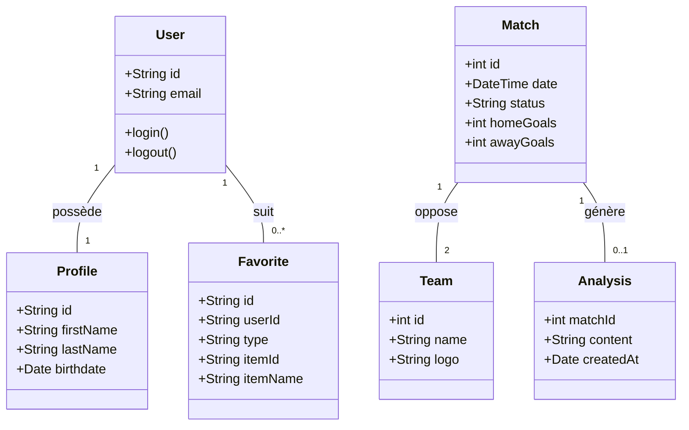
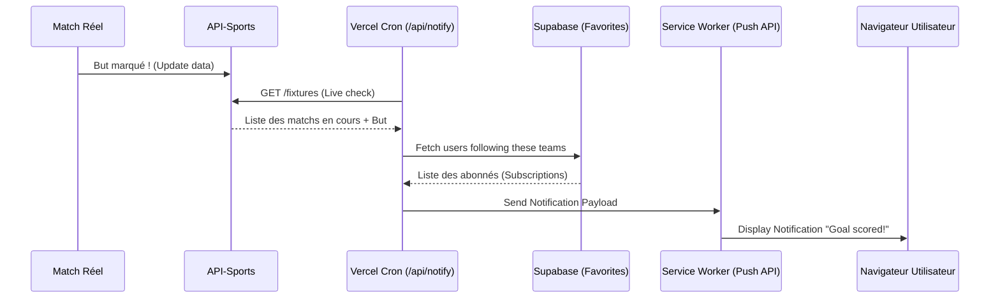
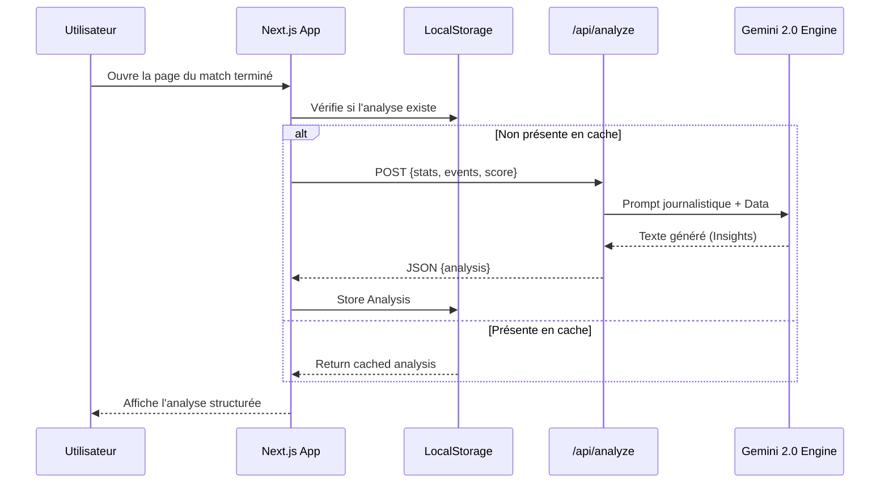
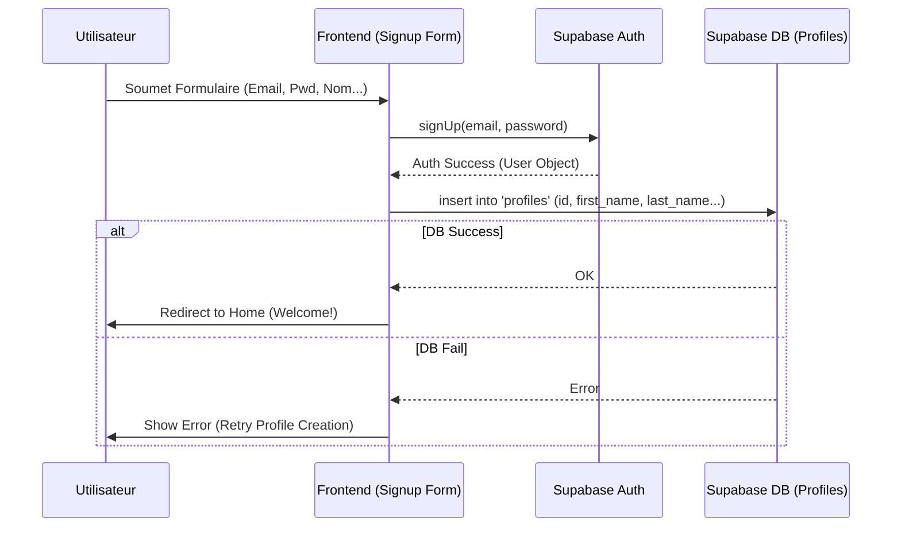

# Rapport de Projet : Ch'hal Daro - Plateforme de Live Scoring Football

## 1. Introduction et Contexte Général
Le projet **Ch'hal Daro** est une application web moderne dédiée au suivi des scores de football en temps réel. Dans un monde où l'information sportive circule instantanément, les fans de football exigent des plateformes non seulement rapides, mais aussi esthétiques et personnalisées. 

L'application a été conçue pour offrir une expérience immersive, allant au-delà du simple affichage de scores en intégrant des analyses intelligentes et des notifications push pour maintenir l'utilisateur engagé, même sans ouvrir l'application.

## 2. Objectifs du Projet
L'objectif principal était de développer une application "Full-Stack" performante capable de :
*   Fournir des scores en direct avec une latence minimale.
*   Offrir une interface utilisateur haut de gamme (Premium) axée sur le mode sombre.
*   Permettre une personnalisation via un système de favoris (équipes et compétitions).
*   Générer des analyses de match automatiques (Insights) basées sur les statistiques réelles.
*   Notifier les utilisateurs des événements importants via Web Push.

## 3. Fonctionnalités Principales
*   **Tableau de bord en direct** : Mise à jour automatique des scores via SWR.
*   **Détails de Match complets** : Compositions, chronologie des événements (buts, cartons, changements) et statistiques détaillées.
*   **Système de Favoris** : Possibilité de suivre des ligues et des équipes pour personnaliser son flux et ses notifications.
*   **Match Insights (IA)** : Génération de rapports journalistiques post-match basés sur les données statistiques.
*   **Prédictions Pré-match** : Analyse de probabilités (Victoire/Nul/Défaite) basée sur les données historiques.
*   **Notifications Push** : Alertes en temps réel sur mobile et desktop pour les buts et événements clés.
*   **Navigation Temporelle** : Possibilité de consulter les matchs d'hier et de demain via un sélecteur de date intuitif.
*   **Pages de Ligues Avancées** : Affichage dynamique des groupes (Champions League), des buteurs, et séparation entre matchs à venir et résultats récents.
*   **Pages Dédiées** : Sections spécifiques pour les équipes, les ligues, et les régions du monde.

## 4. Architecture Technique
L'application repose sur une architecture moderne de type **App Router** (Next.js 15), exploitant les capacités du rendu côté serveur (SSR) et du rendu côté client (CSR) pour un équilibre parfait entre SEO et interactivité.

*   **Frontend** : React 19, Tailwind CSS v4.
*   **Backend** : Next.js API Routes (Serverless).
*   **Base de données & Auth** : Supabase (PostgreSQL).
*   **Data Source** : API-Football (API-Sports).
*   **Moteur d'Analyse** : Google Gemini 2.0 Flash.
*   **Déploiement** : Vercel.

## 5. Choix Technologiques et Justifications

### 5.1 Next.js 15 & React 19
*   **Justification** : Utilisation des **Server Components** pour réduire la charge JavaScript côté client et améliorer le SEO. Next.js 15 apporte des performances accrues et une gestion simplifiée du routing.

### 5.2 Tailwind CSS v4
*   **Justification** : Permet un développement rapide d'interfaces complexes. La version 4 offre un moteur de build plus rapide et une configuration simplifiée via les variables CSS natives, permettant des designs "Dark Mode" profonds et élégants.

### 5.3 SWR (Stale-While-Revalidate)
*   **Justification** : Indispensable pour le "Live Scoring". SWR gère intelligemment le polling en arrière-plan, la mise en cache et la re-validation des données lorsque l'utilisateur revient sur l'onglet, optimisant ainsi les appels API.

### 5.4 Supabase (Auth & Database)
*   **Justification** : Solution "Backend-as-a-Service" robuste. PostgreSQL pour la gestion des favoris et une authentification sécurisée (Email/Password & OAuth) prête pour la production.

### 5.5 Google Gemini 2.0 Flash
*   **Justification** : Intégration de l'intelligence artificielle pour transformer des données brutes (statistiques) en contenu narratif. Le modèle "Flash" a été choisi pour sa rapidité de réponse et son efficacité.

### 5.6 Web Push API & Service Workers
*   **Justification** : Pour envoyer des notifications même lorsque le navigateur est fermé. L'utilisation de Vercel Cron Jobs permet de déclencher ces notifications de manière planifiée.

### 5.7 Navigation par Date
*   **Justification** : Permet aux utilisateurs de planifier leurs visionnages (matchs de demain) ou de rattraper les scores manqués (matchs d'hier) sans quitter l'application, améliorant la rétention utilisateur.

### 5.8 Gestion des Groupes (LDC)
*   **Justification** : Indispensable pour les compétitions internationales comme la Champions League. Le système détecte automatiquement si une ligue est organisée en groupes pour adapter l'affichage du classement.


## 6. Design et Expérience Utilisateur (UX)
Le design de **Ch'hal Daro** repose sur plusieurs piliers :
*   **Mode Sombre Exclusif** : Pour une lisibilité accrue des scores et un aspect "Premium/Gaming".
*   **Glassmorphism** : Utilisation de cartes semi-transparentes avec flou d'arrière-plan (`backdrop-blur`) pour une profondeur visuelle moderne.
*   **Micro-animations** : Transitions fluides (`animate-fade-up`) et indicateurs "Live" pulsés pour rendre l'interface vivante.
*   **Responsive Design** : Optimisation totale pour mobile, tablette et desktop.

## 7. Sécurité et Déploiement
*   **Gestion des Variables d'Environnement** : Toutes les clés API (Sports, Gemini, Supabase) sont isolées côté serveur.
*   **Déploiement sur Vercel** : Intégration continue (CI/CD) depuis GitHub, avec gestion automatique des certificats SSL et des Cron Jobs pour les alertes.

## 9. Diagrammes de Conception (UML)

Cette section présente la modélisation technique du système à travers différents diagrammes UML (rendus via Mermaid).

### 9.1 Diagramme de Cas d'Utilisation (Use Case)
Ce diagramme illustre les interactions entre l'utilisateur, le système Ch'hal Daro et les services externes (APIs).

```mermaid
useCaseDiagram
    actor "Utilisateur" as U
    actor "API Football" as APIF
    actor "Google Gemini" as AI
    actor "Vercel Cron" as Cron

    package "Système Ch'hal Daro" {
        usecase "Consulter les scores en direct" as UC1
        usecase "Gérer ses favoris (équipes/ligues)" as UC2
        usecase "Recevoir des notifications push" as UC3
        usecase "Consulter les insights (IA)" as UC4
        usecase "S'authentifier (Login/Signup)" as UC5
    }

    U --> UC1
    U --> UC2
    U --> UC3
    U --> UC4
    U --> UC5

    UC1 --|> APIF : Récupération data
    UC4 --|> AI : Génération rapport
    UC3 --|> Cron : Trigger automatique
```

### 9.2 Diagramme de Classes
Modélisation des entités principales et de leurs relations.



### 9.3 Diagrammes de Séquence (Scénarios Complexes)

#### Scénario 1 : Flux de Notification de But (Live)
Ce scénario montre comment un but marqué sur le terrain arrive jusqu'au téléphone de l'utilisateur.



#### Scénario 2 : Génération d'Insights via IA
Génération automatique du rapport journalistique après le coup de sifflet final.



#### Scénario 3 : Inscription et Synchronisation de Profil
Processus d'auth complexe avec double écriture (Auth + Table Profil).



### 9.4 Diagrammes d'Activité

#### Activité 1 : Boucle de Rafraîchissement des Scores (SWR)
Gestion intelligente de la consommation de données.

```mermaid
activityDiagram
    start
    :L'utilisateur arrive sur le Dashboard;
    repeat
        :Fetch scores via API Route;
        :Mise à jour de l'interface (React);
        :Attendre 60 secondes;
    backward:L'onglet est-il visible ?;
    repeat while (Oui)
    :Mise en pause du polling;
    stop
```

#### Activité 2 : Processus de Souscription aux Notifications
Gestion des permissions et du Service Worker.

```mermaid
activityDiagram
    start
    :Utilisateur clique sur "Enable Alerts";
    if (Navigateur supporte Push ?) then (Oui)
        :Demander permission à l'utilisateur;
        if (Permission accordée ?) then (Oui)
            :Enregistrement du Service Worker;
            :Génération Endpoint (Push Subscription);
            :Envoi de la souscription à /api/subscribe;
            :Sauvegarde en DB (Lié au User ID);
            :Afficher "Alerts Enabled";
        else (Non)
            :Afficher erreur "Permission denied";
        endif
    else (Non)
        :Bouton grisé;
    endif
    stop
```

## 10. Conclusion
**Ch'hal Daro** n'est pas seulement un agrégateur de scores, c'est une vitrine technologique combinant les dernières avancées du web (Next.js 15, IA générative, Web Push). Le projet démontre qu'il est possible de créer une application de données intensive tout en maintenant une esthétique haut de gamme et une expérience utilisateur fluide.
